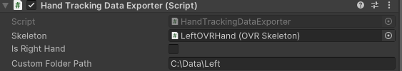
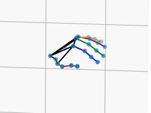

# Thesis Project

This GitHub shows how to extract hand tracking data out of Unity, visualise it using a 3D animation and then apply the data to a robotic hand

## Structure

* [Unity Scripts](Unity%20Scripts) - Folder where the Unity scripts are stored
* [Hand visualisation](Hand%20SVisualisation) - Folder where the code for the hand visualisation is located, along with the csv file(s) used
* [Robot Hand](Robot%20Hand) -  Folder where the code for the animation of the robotic hand is, with the formatted csv file(s)

## Unity

This section will give a step by stepo guide on how to gather hand tracking data from Unity using the Meta Quest 2 VR headset
1. Install Unity and create a new 3D environment
2. Download the Unity Integration Package [here](https://developer.oculus.com/downloads/package/unity-integration/?locale=en_GB) and import it into the environment
3. Remove Main Camera from the Scene on the left hand side Hierarchy tab and locate OVRCameraRig under Assets>Oculus>VR>Prefabs and add it to the Hierarchy tab
4. Expand Left and Right hand anchors and add OVRHandPrefab underneath which can be under Assets>Oculus>VR>Prefabs, rename them for left and right hands
5. Add the [HandTrackingDataExporter.cs](Unity%20Scripts/HandTrackingDataExporter.cs) script to either hand and configure the script as shown below, the same can be replicated for the right hand (remember to tick Is Right Hand and change all other scripts attached to that hand to the relevant hand type)

                
    
6. Attach OVR Passthrough Layer script to OVRCameraRig, by clicking 'Add component' at the bottom of the Inspector tab and enable passthrough in the OVR Manager script and check that the OVRPlugin is set to OpenXR under Oculus>Tools>OVR Utilities Plugin
7. Enable hand tracking support for Hands under OVR Manager script
8. Link your Meta Quest 2 headset to your computer using the Quest Link and verify that it is connected
9. Press play on the game scene and perform any type of hand movements within the virtual environment 
10. Press the play button once again and the hand tracking data will appear as a csv file wherever you set your custom path folder to be in the [HandTrackingDataExporter.cs](Unity%20Scripts/HandTrackingDataExporter.cs) script!

## Hand tracking data visualisation

For this project, 3D hand visualisation was used to verify the accuracy of the hand tracking data

To visualise the hand tracking data gathered from the Unity section above:

Open the [finalhandanimation.py](Hand%20Visualisation/finalhandanimation.py) file and change the data_path variable to the path of your hand tracking data csv file.

Install the libraries if needed using `!pip install`

Simply run the code and the 3D hand animation should appear in a separate window that looks similar to this image:

## Robotic Hand 

To apply the hand tracking data to a virtual robotic hand the original dataset must be formatted correctly to be read correctly by the robotic hands control system. The robotic hand used for this project is the [Shadow Dexterous Hand](https://www.shadowrobot.com/wp-content/uploads/2022/03/shadow_dexterous_hand_e_technical_specification.pdf) provided by [Simox](https://github.com/shadow-robot/simox_ros/tree/master). 

Firstly, open the [robot_data_clean.py](Robot%20Hand/robot_data_clean.py) file and once again change the data path variable to the path of the hand tracking csv file. The new formatted csv file will be used to apply to the robotic hand. 

[PyBullet](https://github.com/bulletphysics/bullet3) is the physics SDK used, follow their installation insructions to install the recent version.

Open the [finalrobothand.py](Robot%20Hand/finalrobothand.py) file and change the file path to where the new formatted data is stored. 

Run the code and a new window will appear in PyBullet with the animation of the robotic hand!
